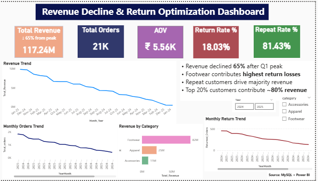
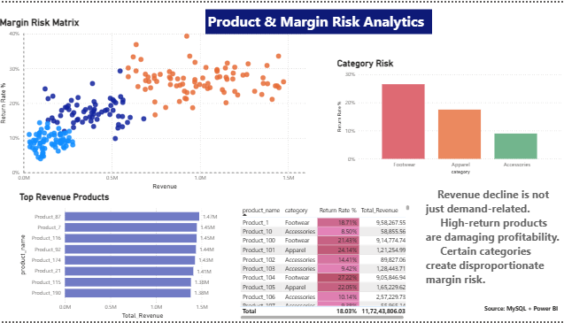
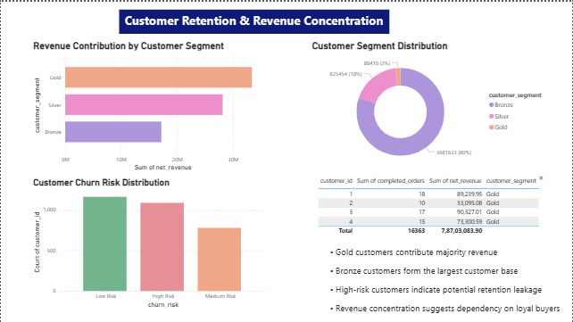

# Revenue Decline & Return Optimization Analysis

End-to-end business analytics project using SQL, Python, and Power BI to analyze revenue decline trends, return-risk products, customer retention behavior, and revenue concentration patterns in an e-commerce business.

---

# Business Problem

The business experienced declining revenue after an early growth phase while product returns increased significantly, impacting profitability and operational efficiency.

This project analyzes:

- Revenue decline trends
- High return-risk categories and products
- Customer retention behavior
- Revenue concentration dependency
- Margin risk across categories

---

# Tech Stack

- SQL (MySQL)
- Python
- Pandas
- Matplotlib
- Power BI
- VS Code
- GitHub

---
# Dataset

**Type:** Synthetic e-commerce dataset  
**Purpose:** Generated to simulate realistic e-commerce transaction behavior for analytical demonstration  
**Records:** ~20,000 transactions across product categories, customer segments, and time periods  
**Note:** Synthetic data was used intentionally to enable controlled analysis of revenue decline patterns, return behavior, and customer segmentation without real business data constraints.

---

# Key Analyses Performed

## Revenue Trend Analysis
- Month-over-month revenue decline analysis
- Order trend tracking
- Revenue slowdown identification

## Return & Margin Risk Analysis
- Return-loss percentage by category
- High-risk product identification
- Margin risk matrix analysis

## Product Performance Analysis
- Top revenue-generating products
- High-demand products
- High return-rate products

## Customer Retention & RFM Segmentation
- Repeat customer analysis
- Customer segmentation using RFM
- Churn risk analysis

## Revenue Concentration Analysis
- Pareto analysis
- Top customer revenue contribution
- Loyal customer dependency analysis

---

# Key Business Insights

- Revenue declined ~65% after peak growth period
- Footwear category generated the highest return losses (~29%)
- Repeat customers contributed the majority of revenue
- Top 20% customers contributed ~78% of total revenue
- High-return products significantly impacted profitability
- Potential customer retention leakage identified in at-risk segments

---

# Power BI Dashboard

The project includes a 3-page interactive Power BI dashboard.

---

## Dashboard Page 1 — Revenue Decline Overview

Features:
- KPI summary cards
- Revenue trend analysis
- Orders trend analysis
- Monthly return trends
- Revenue by category



---

## Dashboard Page 2 — Product & Margin Risk Analytics

Features:
- Margin risk matrix
- Product revenue vs return risk analysis
- Category return-risk analysis
- Top revenue products



---

## Dashboard Page 3 — Customer Retention & Revenue Concentration

Features:
- Customer segment distribution
- Revenue contribution by segment
- Churn risk analysis
- Revenue concentration insights



---

# Python Automation

Python scripts were used to automate:

- SQL query execution
- CSV exports
- Automated chart generation
- Business report generation

Generated outputs include:
- Revenue trend charts
- Pareto analysis charts
- Return-loss visualizations
- RFM segmentation charts
- Automated business summary reports

---

# Project Structure

```bash
Revenue-Decline-Return-Optimization-Analysis/
│
├── 01_sql/
├── 02_python/
├── 03_powerbi/
├── 04_outputs/
│   ├── charts/
│   ├── csv/
│   └── report/
│
├── 05_dashboard_images/
│
├── README.md
├── requirements.txt
└── LICENSE
```

---

# How to Run

```bash
pip install -r requirements.txt
```

Update database credentials inside:

```python
db_connection.py
```

Run pipeline:

```bash
python run_pipeline.py
```

---

# Final Conclusion

This project demonstrates an end-to-end analytics workflow combining SQL, Python automation, and Power BI storytelling to solve business problems related to:

- Revenue decline
- Margin risk
- Product returns
- Customer retention
- Revenue concentration
